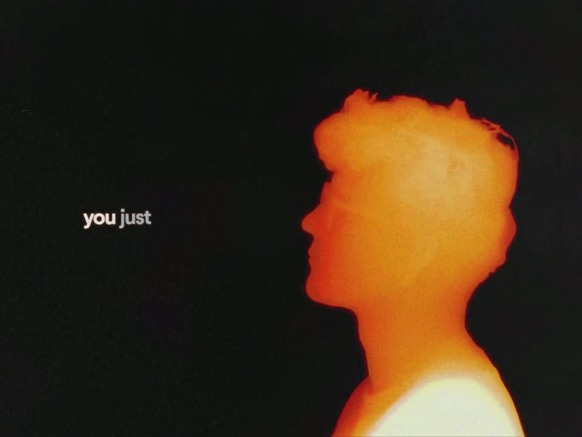

# Motion Recreation

An editable recreation of a 20-second motion-design film, built with **Astra**, JavaScript, Canvas and WebGL.

[Watch or download the demo](https://github.com/Leonxlnx/motion-recreation/releases/download/v1.0.0/motion-recreation-demo.mp4) · [Download the texture assets](https://github.com/Leonxlnx/motion-recreation/releases/tag/v1.0.0)



The browser draws the animation from scene code, measured motion, vector geometry, reusable artwork and material textures. It does not play the reference video or a sequence of complete screenshots.

## Run locally

Install [Node.js 22 or newer](https://nodejs.org/), then:

```sh
git clone https://github.com/Leonxlnx/motion-recreation.git
cd motion-recreation
npm ci
npm run setup
npm start
```

Open **http://127.0.0.1:4173**. Play, scrub, switch between smooth and original timing, enable sound, or enter fullscreen. Space toggles playback; the arrow keys step through original frames.

The setup command downloads **about 8.6 GB** of recovered grain textures from the GitHub release. These are kept out of Git history. Each download and installed texture is checked against a SHA-256 manifest; verified parts are skipped when resuming setup. Allow around **10 GB of free disk space** for the installed textures and one temporary archive. `npm run verify-assets` checks the local asset installation without downloading anything.

There are no API keys or AI services required to run the animation.

## What is implemented

- A timeline covering **489 source frames** at **24000/1001 fps**, with continuous motion between measured frames.
- Reusable pixel-art objects, affine/projective motion, occlusion, blur and color response.
- The colored head and hand, reconstructed from contours and an editable color mesh.
- Traced typography, animated ink marks, light fields and recovered film-grain materials.
- Local playback controls and an offline video renderer.

The scene uses a 720 × 540 design space and can render at different resolutions. Smooth timing interpolates the measured motion; it does not guarantee sustained 60 fps on every computer.

## Fidelity and limitations

This is a close recreation, **not a pixel-identical clone**. The last complete native-resolution audit, checkpoint 11, compared all 489 frames at 2880 × 2160:

| Measurement | Result |
|---|---:|
| Mean whole-frame RGB SSIM | 0.97709338 |
| Lowest frame SSIM | 0.93770882 |
| Mean foreground SSIM | 0.93942002 |
| Frames with SSIM ≥ 0.99 | 155 / 489 |

SSIM is a particular image metric, not a universal percentage of visual similarity. The demo is checkpoint 11. This repository contains the later source refinements, including cap and plant motion, controller placement and exterior lighting; those changes have not received another complete film audit. No 99% result is claimed for the published source.

The compact audit is in [docs/checkpoint-11-metrics.json](docs/checkpoint-11-metrics.json). Browser/font rasterization can vary slightly between platforms. The public build uses an installed Arial Bold where available and otherwise the bundled open-licensed Arimo font; the original Windows font is not redistributed.

## Export video or frames

Install [FFmpeg](https://ffmpeg.org/) and the Playwright browser:

```sh
npx playwright install chromium

# H.264, original cadence, original dimensions
npm run render -- renders/native.mp4 2880 23.976023976023978

# Smooth 60 fps export
npm run render -- renders/smooth.mp4 1440 60

# Individual PNG frames: first, middle and last
npm run render -- renders/frames 1440 23.976023976023978 1,245,489
```

`CHROME_PATH` can select an existing Chrome installation. `VIDEO_CRF` controls H.264 quality (default 10); `VIDEO_THREADS` controls encoder threads (default 2). `VIDEO_CODEC=vp9-lossless` produces lossless RGB VP9 in MP4; an `.mkv` output defaults to FFV1. `RENDER_AUDIT=1` saves per-frame RGBA hashes beside the export. Offline export can take substantial time and memory at full resolution.

## Compare with a reference

Python 3.10 or newer is optional and is used only for analysis:

```sh
python -m pip install -r requirements.txt
python tools/compare.py path/to/reference.mp4 renders/native.mp4 renders/comparison 2880
```

The comparator reports whole-frame and foreground SSIM, pixel error and the worst frames. Native-resolution verification is required for native-resolution claims.

## Project layout

```text
app.js                 timeline and playback controls
scenes/                geometry, objects, typography, lighting and grain
assets/                artwork, soundtrack, measured data and font
assets/grain/          material manifest; downloaded texture PNGs
assets-release.json    texture inventory and release checksums
tools/                 asset setup, rendering and comparison
docs/                  preview and compact audit
```

## Reference artwork and attribution

Reference / challenge: [the original X post shared by @jordanarchivess](https://x.com/jordanarchivess/status/2107536262894915762).

The reference film, extracted artwork and soundtrack belong to their respective creators. Some source artwork and audio are reused; the motion, layout, geometry and compositing were reconstructed in code.

Public availability does not grant a license to the reference media. See [NOTICE.md](NOTICE.md) for the scope of included material and the font license.
